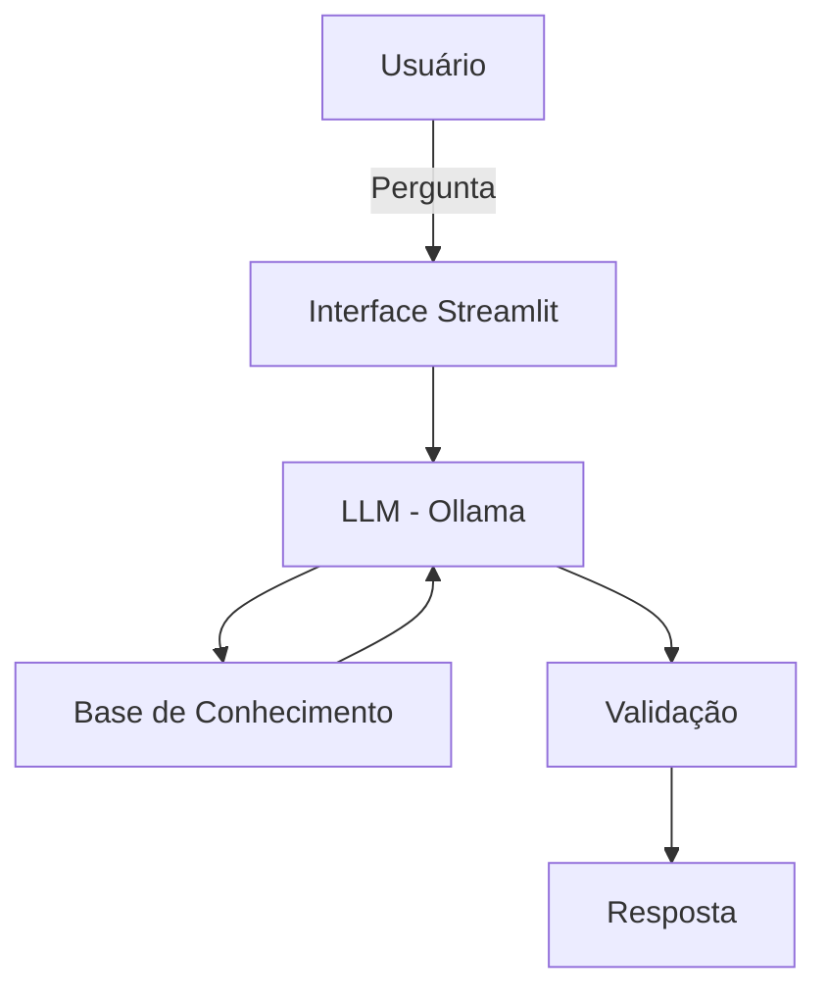

# 🤖 Alice - Agente de Organização Financeira com IA

Agente conversacional inteligente que ajuda usuários a entenderem e organizarem sua vida financeira usando IA Generativa.

## 💡 Sobre o Projeto

Alice é um assistente financeiro pessoal que transforma dados financeiros complexos em insights simples e acionáveis. Desenvolvido como solução para o desafio de criar um agente inteligente no setor financeiro, a Alice atua de forma consultiva e empática, sem julgamentos.

### O Problema

Muitas pessoas perdem o controle de suas finanças porque extratos bancários e faturas apresentam apenas listas de números, sem contexto ou explicações claras.

### A Solução

Alice analisa gastos, identifica padrões, detecta comportamentos atípicos e explica tudo em linguagem acessível, ajudando na tomada de decisões financeiras conscientes.

## ✨ Funcionalidades

- 📊 Análise de gastos por categoria
- 🔍 Identificação de padrões de consumo
- 💡 Insights personalizados baseados no perfil do usuário
- 🛡️ Respostas seguras (sem alucinações)
- 💬 Interface conversacional intuitiva

## 🏗️ Arquitetura



**Componentes:**
- **Interface:** Streamlit
- **LLM:** Ollama (modelo local gpt-oss:20b)
- **Dados:** CSV e JSON mockados

## 🚀 Como Executar

### Pré-requisitos

- Python 3.8+
- [Ollama](https://ollama.ai/) instalado

### Instalação

1. Clone o repositório
```bash
git clone <seu-repositorio>
cd <nome-do-repositorio>
```

2. Instale as dependências
```bash
pip install streamlit pandas requests
```

3. Configure o Ollama
```bash
# Baixe o modelo
ollama pull gpt-oss:20b

# Inicie o servidor Ollama
ollama serve
```

4. Execute a aplicação
```bash
streamlit run src/app.py
```

## 📁 Estrutura do Projeto

```
├── data/                      # Base de conhecimento
│   ├── transacoes.csv
│   ├── perfil_cliente.json
│   ├── contas.json
│   ├── cartoes.json
│   └── ...
├── docs/                      # Documentação completa
│   ├── 01-documentacao-agente.md
│   ├── 02-base-conhecimento.md
│   ├── 03-prompts.md
│   ├── 04-metricas.md
│   └── 05-pitch.md
├── src/
│   └── app.py                # Aplicação principal
└── README.md
```

## 🎯 Diferenciais

- **Sem Alucinações:** Respostas baseadas exclusivamente em dados fornecidos
- **Empática:** Tom acolhedor que reduz ansiedade financeira
- **Transparente:** Admite limitações e nunca inventa informações
- **Local:** Execução 100% local, sem envio de dados para nuvem

## 📊 Métricas de Qualidade

| Métrica | Resultado |
|---------|-----------|
| Assertividade | ✅ Correto |
| Segurança (Anti-alucinação) | ✅ Correto |
| Coerência com perfil | ✅ Correto |
| Tratamento de edge cases | ✅ Correto |

## 🎬 Demonstração

[Link para vídeo pitch de 3 minutos]

## 📝 Limitações

- Não substitui consultor financeiro profissional
- Não realiza recomendações de investimentos específicas
- Não toma decisões pelo usuário
- Não acessa dados reais sem consentimento

## 🛠️ Tecnologias

- **Python** 3.8+
- **Streamlit** - Interface web
- **Ollama** - Execução local de LLMs
- **Pandas** - Manipulação de dados

## 📖 Documentação Completa

Documentação detalhada disponível em [`docs/`](./docs/):
- [Documentação do Agente](./docs/01-documentacao-agente.md)
- [Base de Conhecimento](./docs/02-base-conhecimento.md)
- [Engenharia de Prompts](./docs/03-prompts.md)
- [Métricas e Avaliação](./docs/04-metricas.md)
- [Pitch](./docs/05-pitch.md)

## 👤 Autor

Roberto Barboza Lima

Desenvolvido como parte do desafio DIO - Agente Financeiro Inteligente com IA Generativa


